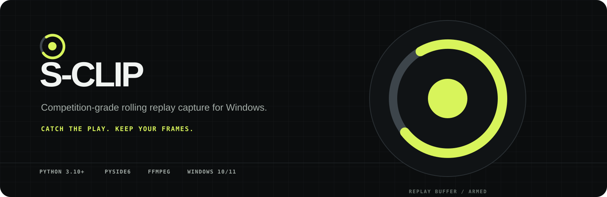
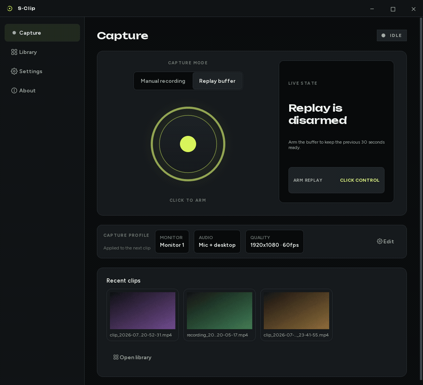
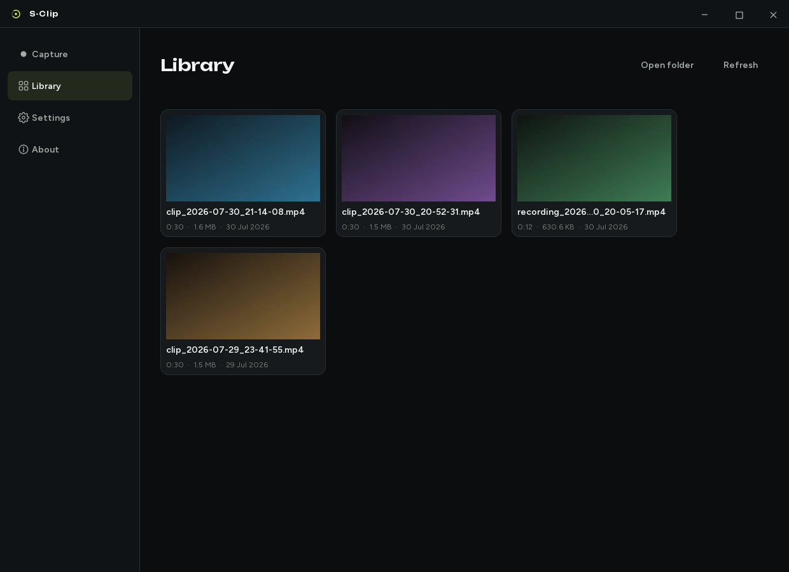
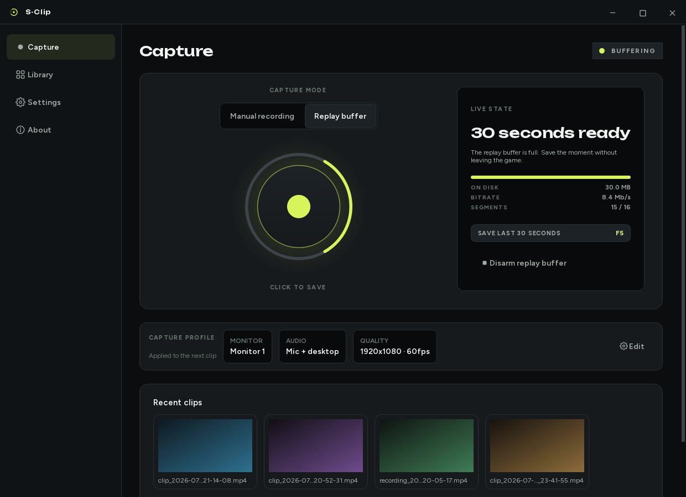
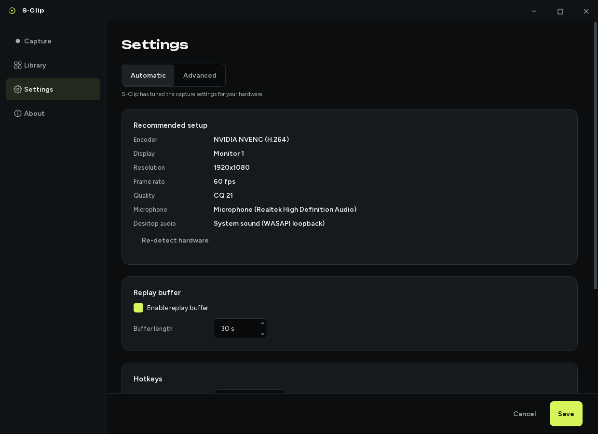
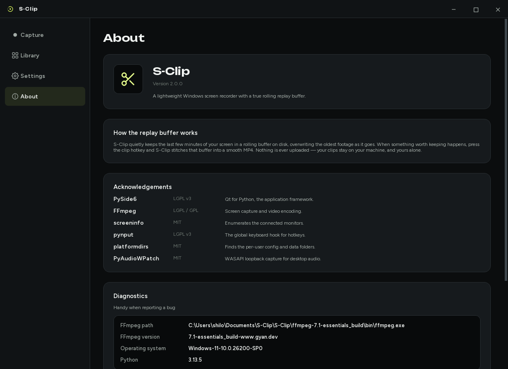
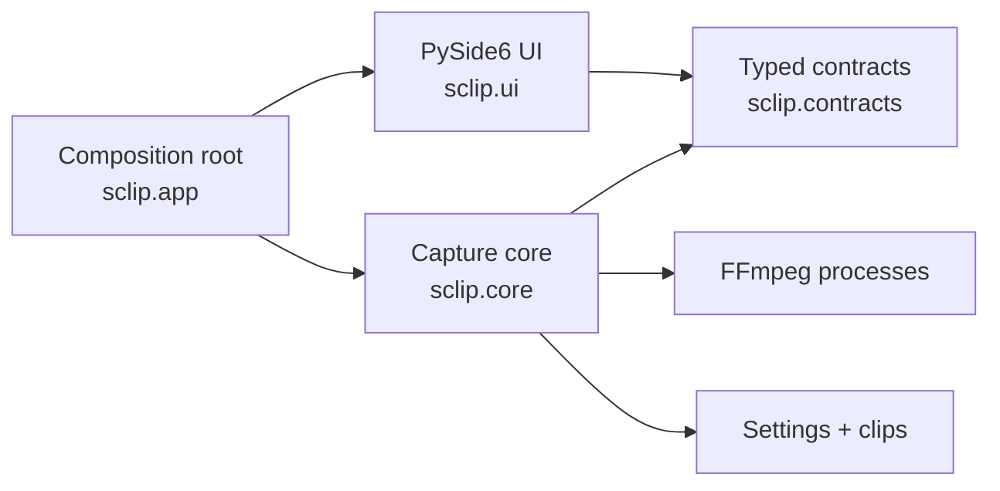

<p align="center">
  
</p>

<p align="center">
  <a href="https://github.com/shilohhm/S-Clip/actions/workflows/ci.yml"></a>
  
  
  <a href="./LICENSE"></a>
</p>

S-Clip is a native Windows capture client for competitive players. It keeps a
real rolling replay buffer on disk, listens for global hotkeys, and turns the
previous few seconds of play into a smooth MP4 without pulling you out of the
match.

<p align="center">
  
</p>

<p align="center"><em>Arming an empty buffer, filling to the configured window, saving, and the finished clip landing.</em></p>

## Why S-Clip

- **The clip is what just happened.** FFmpeg rotates short MPEG-TS segments
  through a bounded buffer, then joins the current window when you press the
  clip hotkey.
- **The readout never overstates the buffer.** A rolling buffer starts empty
  and takes your whole window to fill. S-Clip reports what a save would
  actually produce at that instant — *18 of 30 seconds buffered* — because the
  figure is read from the same segment snapshot the save path uses. The number
  on screen cannot drift from the clip you get.
- **Capture stays on the GPU.** S-Clip prefers Desktop Duplication through
  `ddagrab` and automatically selects NVENC, AMD AMF, or Intel Quick Sync when
  the machine supports it.
- **Game audio and microphone are handled together.** Windows WASAPI loopback
  captures desktop sound without a virtual cable, while DirectShow supplies
  the microphone input.
- **First launch is hardware-aware.** Display geometry, frame rate, encoder,
  preset, and quality defaults are selected from the detected machine rather
  than a one-size-fits-all profile.
- **The interface stays out of the match.** Global hotkeys, tray operation,
  direct state feedback, and a local clip library keep the common path short.

## The rest of the interface

<p align="center">
  
</p>

<details>
<summary>Capture, Settings and About</summary>

<p align="center">
  
</p>

<p align="center">
  
</p>

<p align="center">
  
</p>

</details>

> **About these images.** They are generated by
> [`render_readme_screenshot.py`](./scripts/render_readme_screenshot.py) and
> [`render_demo_gif.py`](./scripts/render_demo_gif.py), which render the real
> window offscreen against in-memory collaborators, so they are reproducible and
> never touch a developer's own clips folder. The sample recordings are genuinely
> encoded by FFmpeg and thumbnailed through the same code path the library uses;
> their content is a generated gradient rather than real gameplay footage. In the
> animation the interface is real and the capture engine is scripted — driving a
> live capture would mean committing whatever happened to be on the author's
> screen.

## Engineering highlights

S-Clip is deliberately small at the surface and serious underneath:

| Area | Design |
| --- | --- |
| Capture | GPU-first Desktop Duplication with a guarded GDI fallback |
| Replay | Bounded segment ring, asynchronous save worker, and constant-rate final timeline |
| Telemetry | Buffer fill, footprint and bitrate read from the snapshot the save path uses, so the readout cannot drift from the clip |
| Concurrency | Explicit FFmpeg process ownership and Qt-thread event bridges |
| Architecture | Typed `Protocol` boundaries between UI, capture core, devices, and persistence |
| Settings | Atomic writes, schema migration, hostile-input validation, and hardware-tuned defaults |
| Quality | Strict mypy, Ruff, a whole-package coverage gate covering the interface as well as the core, and Windows CI across Python 3.10–3.13 |

The final replay stitch intentionally re-encodes. A stream copy is faster, but
small audio/video duration differences at each segment boundary can produce
visible timing seams. S-Clip spends a few seconds building one constant-rate
timeline so the saved clip plays cleanly.

## Install

Download the latest installer from
[Releases](https://github.com/shilohhm/S-Clip/releases) and run it. It installs
for the current user, so there is no administrator prompt, and it leaves your
clips and settings alone if you later uninstall.

You also need FFmpeg, which S-Clip drives to capture and encode:

```powershell
winget install Gyan.FFmpeg
```

The installer checks for FFmpeg and says so if it is missing. Without it the
interface still opens and the About page explains the problem, but nothing can
be recorded.

> **The installer is not signed.** Code signing needs a certificate issued
> against a verified identity, and this project does not have one. Windows
> SmartScreen will therefore show *"Windows protected your PC"* the first time
> you run it: choose **More info**, then **Run anyway**. If you would rather
> check the download yourself, each release ships a `SHA256SUMS.txt` beside the
> installer. Saying this plainly seems better than letting the warning come as a
> surprise.

### Running from source

Requires Windows 10 or 11, Python 3.10–3.13, and FFmpeg on `PATH`.

```powershell
git clone https://github.com/shilohhm/S-Clip.git
cd S-Clip
py -3.13 -m venv .venv
.\.venv\Scripts\Activate.ps1
python -m pip install .
sclip-gui
```

For development, install the quality tooling with `python -m pip install -e ".[dev]"`.

S-Clip also picks up FFmpeg placed beside it, which is how the portable layout
works: put the binary at `ffmpeg\bin\ffmpeg.exe` next to `S-Clip.exe` (or, in a
checkout, at the repository root) and it will be preferred over whatever is on
`PATH`. Those directories are ignored by Git and never shipped in the source
repository.

## Use

| Default input | Action |
| --- | --- |
| `F5` | Save the current replay window |
| `Ctrl+F6` | Start or stop a manual recording |
| Record control | Run the action shown by the current capture state |
| System tray | Save a clip, toggle recording, show S-Clip, or quit |

Hotkeys are global and remappable. Recordings land in the platform data
directory by default, with an optional custom output directory in Settings.

## Architecture



The core contains no Qt imports. UI code consumes small typed contracts, while
`sclip.app` wires the concrete engine, settings store, device registry, hotkey
listener, and window together. The result is a capture pipeline that can be
tested without booting the desktop interface.

See [`docs/ARCHITECTURE.md`](./docs/ARCHITECTURE.md) for the module map,
threading model, replay save sequence, and rationale behind the main technical
decisions.

## Verification

```powershell
python -m ruff check .
python -m ruff format --check .
python -m mypy src
python -m pytest -m "not slow"
```

The full suite includes FFmpeg-backed replay integration tests:

```powershell
python -m pytest
```

Coverage is gated over the whole package rather than the core alone, so the
interface counts too:

```powershell
python -m pytest -m "not slow" --cov=sclip --cov-report=term-missing
```

CI runs linting, formatting, strict type checking, that coverage gate,
compatibility tests, wheel builds, and packaged-asset verification on Windows.

## Project status

S-Clip 2.0 is in beta. The capture engine, rolling replay buffer, desktop audio
path, settings migration, and desktop interface are implemented, and ship as a
per-user Windows installer built and published by
[`release.yml`](./.github/workflows/release.yml) on a version tag.

The installer is unsigned, which is the honest remaining gap rather than a
planned feature: signing needs a code-signing certificate tied to a verified
identity, so it waits on one being obtained rather than on any work in this
repository. [`packaging/sclip.iss`](./packaging/sclip.iss) already carries the
`SignTool` hook, commented, for the day there is a certificate to point it at.
FFmpeg is a prerequisite rather than a bundled dependency; redistributing a GPL
build alongside an MIT application raises licensing questions that a one-line
`winget` install avoids entirely.

## Contributing and licence

Read [`CONTRIBUTING.md`](./CONTRIBUTING.md) before opening a pull request.
S-Clip is MIT licensed; third-party asset notices live in
[`THIRD_PARTY_NOTICES.md`](./THIRD_PARTY_NOTICES.md).

Built by [Shiloh Malka](https://github.com/shilohhm).
