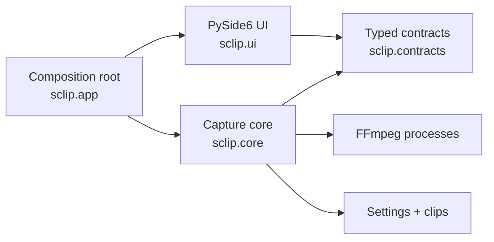

<p align="center">
  
</p>

<p align="center">
  <a href="https://github.com/shilohhm/S-Clip/actions/workflows/ci.yml"></a>
  
  
  <a href="./LICENSE"></a>
</p>

S-Clip is a native Windows capture client for competitive players. It keeps a
real rolling replay buffer on disk, listens for global hotkeys, and turns the
previous few seconds of play into a smooth MP4 without pulling you out of the
match.

<p align="center">
  
</p>

## Why S-Clip

- **The clip is what just happened.** FFmpeg rotates short MPEG-TS segments
  through a bounded buffer, then joins the current window when you press the
  clip hotkey.
- **Capture stays on the GPU.** S-Clip prefers Desktop Duplication through
  `ddagrab` and automatically selects NVENC, AMD AMF, or Intel Quick Sync when
  the machine supports it.
- **Game audio and microphone are handled together.** Windows WASAPI loopback
  captures desktop sound without a virtual cable, while DirectShow supplies
  the microphone input.
- **First launch is hardware-aware.** Display geometry, frame rate, encoder,
  preset, and quality defaults are selected from the detected machine rather
  than a one-size-fits-all profile.
- **The interface stays out of the match.** Global hotkeys, tray operation,
  direct state feedback, and a local clip library keep the common path short.

## Engineering highlights

S-Clip is deliberately small at the surface and serious underneath:

| Area | Design |
| --- | --- |
| Capture | GPU-first Desktop Duplication with a guarded GDI fallback |
| Replay | Bounded segment ring, asynchronous save worker, and constant-rate final timeline |
| Concurrency | Explicit FFmpeg process ownership and Qt-thread event bridges |
| Architecture | Typed `Protocol` boundaries between UI, capture core, devices, and persistence |
| Settings | Atomic writes, schema migration, hostile-input validation, and hardware-tuned defaults |
| Quality | Strict mypy, Ruff, pytest, deterministic UI assets, and Windows CI across Python 3.10–3.13 |

The final replay stitch intentionally re-encodes. A stream copy is faster, but
small audio/video duration differences at each segment boundary can produce
visible timing seams. S-Clip spends a few seconds building one constant-rate
timeline so the saved clip plays cleanly.

## Quick start

### Requirements

- Windows 10 or 11
- Python 3.10–3.13
- FFmpeg 4.0 or newer available on `PATH`

Clone and install:

```powershell
git clone https://github.com/shilohhm/S-Clip.git
cd S-Clip
py -3.13 -m venv .venv
.\.venv\Scripts\Activate.ps1
python -m pip install .
```

Launch without a console window:

```powershell
sclip-gui
```

For development, install the quality tooling:

```powershell
python -m pip install -e ".[dev]"
```

S-Clip can also use a bundled FFmpeg build during local development. Place it
at `ffmpeg-<version>-essentials_build/bin/ffmpeg.exe`; the directory is ignored
by Git and never shipped in the source repository.

## Use

| Default input | Action |
| --- | --- |
| `F5` | Save the current replay window |
| `Ctrl+F6` | Start or stop a manual recording |
| Record control | Run the action shown by the current capture state |
| System tray | Save a clip, toggle recording, show S-Clip, or quit |

Hotkeys are global and remappable. Recordings land in the platform data
directory by default, with an optional custom output directory in Settings.

## Architecture



The core contains no Qt imports. UI code consumes small typed contracts, while
`sclip.app` wires the concrete engine, settings store, device registry, hotkey
listener, and window together. The result is a capture pipeline that can be
tested without booting the desktop interface.

See [`docs/ARCHITECTURE.md`](./docs/ARCHITECTURE.md) for the module map,
threading model, replay save sequence, and rationale behind the main technical
decisions.

## Verification

```powershell
python -m ruff check .
python -m ruff format --check .
python -m mypy src
python -m pytest -m "not slow"
```

The full suite includes FFmpeg-backed replay integration tests:

```powershell
python -m pytest
```

CI runs linting, formatting, strict type checking, coverage, compatibility
tests, wheel builds, and packaged-asset verification on Windows.

## Project status

S-Clip 2.0 is in beta. The capture engine, rolling replay buffer, desktop audio
path, settings migration, and desktop interface are implemented. Distribution
is currently source/wheel based; a signed Windows installer is the next major
release milestone.

## Contributing and licence

Read [`CONTRIBUTING.md`](./CONTRIBUTING.md) before opening a pull request.
S-Clip is MIT licensed; third-party asset notices live in
[`THIRD_PARTY_NOTICES.md`](./THIRD_PARTY_NOTICES.md).

Built by [Shiloh Malka](https://github.com/shilohhm).
