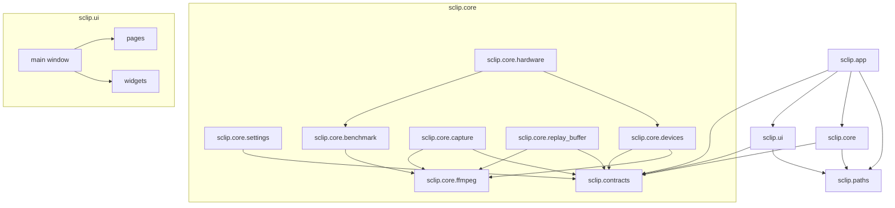

# S-Clip Architecture

This document describes how the parts of S-Clip fit together. It is intended for
new contributors and for anyone who needs to reason about the threading model
when fixing a bug or adding a feature.

## Module map



Three rules govern the dependency graph:

1. The contracts package never depends on anything inside S-Clip. Every other
   module is allowed to depend on it.
2. The `core` packages depend only on `contracts` and `paths`. They contain no
   PySide6 imports, which is what makes them testable without a `QApplication`.
3. The `ui` package depends on the `core` interfaces, not on their concrete
   implementations. The application wiring lives in `sclip.app`.

## Responsibility table

| Module                       | Responsibility                                                                 | Explicit non-goals                                          |
|------------------------------|--------------------------------------------------------------------------------|-------------------------------------------------------------|
| `sclip.contracts`            | Data classes, enums and `Protocol`s shared by every other module               | No I/O, no state, no FFmpeg knowledge                       |
| `sclip.paths`                | Resolve every user-writable and bundled path via `platformdirs`                | No mutation, no creation of files (only directories)        |
| `sclip.version`              | One-line constant for the package version                                      | Anything else                                               |
| `sclip.logging_config`       | Configure the root logger to write to file and console with sensible levels    | Application logic                                           |
| `sclip.core.settings`        | Read and write the user's settings file atomically; migrate legacy schemas     | UI concerns, FFmpeg invocation                              |
| `sclip.core.devices`         | Enumerate monitors and audio devices; cache the results across calls           | Persistent storage of selections                            |
| `sclip.core.ffmpeg`          | Locate the FFmpeg binary; spawn FFmpeg with the right plumbing                 | Application policy (which encoder, which preset)            |
| `sclip.core.capture`         | Implement the `CaptureEngine` protocol - drives FFmpeg for manual recording    | Owning the replay buffer (delegated to `replay_buffer`)     |
| `sclip.core.replay_buffer`   | Maintain a rolling FFmpeg segment muxer; concatenate segments into a clip      | Choosing when to clip (the GUI decides)                     |
| `sclip.core.benchmark`       | Time encoders at a real capture target and judge whether they can sustain it   | Deciding what to do about the answer (that is `hardware`)   |
| `sclip.core.hardware`        | Probe the machine and derive a recommended `Settings` from what it measures    | Persisting the result (the settings page saves it)          |
| `sclip.ui`                   | PySide6 main window, pages, widgets, theming                                   | Anything that does not involve drawing pixels or handling input |
| `sclip.app`                  | Wire the concrete implementations together at start-up; install the tray icon  | The actual recording                                        |

## Data flow: saving a replay clip

The most subtle interaction in S-Clip is the path from a hotkey press to a
finished MP4 file. This is the canonical sequence.

```
Main GUI thread          Hotkey listener thread          Capture engine thread          FFmpeg processes
       |                          |                              |                              |
       |                          |  user presses F5             |                              |
       |                          | <--------------------------- |                              |
       |                          |                              |                              |
       |  on_clip_requested()     |                              |                              |
       | <----------------------  |                              |                              |
       |                          |                              |                              |
       |  engine.save_replay_clip()                              |                              |
       | ----------------------------------------------------->  |                              |
       |                          |                              |  snapshot segment list       |
       |                          |                              | ---------------------------> |
       |                          |                              |                              |
       |                          |                              |  spawn concat FFmpeg         |
       |                          |                              | ---------------------------> |
       |                          |                              |                              |
       |                          |                              | <--------------------------- |
       |                          |                              |  concat exits, MP4 ready     |
       |  clip_path: Path | None                                 |                              |
       | <----------------------------------------------------   |                              |
       |                          |                              |                              |
       |  refresh clip library UI |                              |                              |
       |                          |                              |                              |
```

Numbered steps:

1. The user presses the configured clip hotkey. `pynput` delivers the event on
   its own listener thread.
2. The hotkey handler calls back into the engine façade on the GUI thread (via
   `QMetaObject.invokeMethod` or a `QTimer.singleShot(0, ...)`) so that any UI
   updates that fall out of step 6 can happen without crossing a Qt thread
   boundary.
3. The engine acquires the rolling buffer's lock, snapshots the current list of
   `.ts` segments on disk and writes out a concat list file.
4. The engine spawns a second, short-lived FFmpeg process to concatenate the
   segments. The rolling muxer keeps running - the segments are read-only from
   the concat job's perspective, so the two FFmpeg processes do not interfere.
5. The concat FFmpeg exits. The engine deletes the concat list file and verifies
   the output exists and is non-empty.
6. The engine returns the path to the GUI thread, which adds an entry to the
   clip library and shows a toast notification.

If the concat fails, the engine retries once after a brief delay (to dodge the
race where the rolling muxer rotated a segment we were about to read). If the
retry also fails the error handler installed by the GUI is invoked with a
human-readable message.

## Threading model

S-Clip runs on four distinct threads.

- **Main GUI thread (Qt).** Owns every widget. All updates to the clip library,
  status bar, settings page and tray icon happen here. Long-running work is
  delegated to other threads and dispatched back through `QTimer.singleShot`
  or queued signals.
- **Hotkey listener thread (pynput).** A daemon thread that wakes when the user
  presses a registered key combination. Its only job is to translate the OS
  event into a callback invocation on the engine.
- **Capture engine thread.** Spawned on demand for the manual recording mode.
  Holds the FFmpeg `Popen` and drains its stderr asynchronously so the GUI
  cannot block on a slow pipe write.
- **Rolling buffer FFmpeg process.** Lives as a child subprocess for the entire
  lifetime of the buffer (typically the whole session). It is not a Python
  thread, but the buffer owner owns the `Popen` handle and treats it as one.

Synchronisation between threads:

- The rolling buffer uses an `RLock` to guard the `_process` handle and the
  list of on-disk segments. Every public method acquires this lock; the
  re-entrant variant lets handlers restart the buffer (stop then start) without
  deadlocking.
- The engine surfaces non-fatal errors through an optional callback rather than
  Qt signals - see "Design decisions" below for the rationale.
- Settings are loaded once at startup and again whenever the settings page
  closes. There is no shared mutable settings state between threads; the GUI
  always works with a draft copy and writes back atomically.

## Design decisions

**Why PySide6 rather than PyQt5.** PySide6 is the official Qt-for-Python
binding, distributed by The Qt Company under the LGPL. PyQt5 is GPL/commercial
and would force the project either to release under the GPL or to buy
commercial licences. PySide6 also tracks Qt 6 releases, which gives us proper
high-DPI support, an updated widget set and Wayland support if we ever target
Linux.

**Why `ddagrab` for screen capture.** The original build used `gdigrab`, which
scrapes the screen through GDI. That path cannot sustain high resolutions and
frame rates - it delivers frames late and unevenly, and the judder is baked into
every recording. `ddagrab` wraps the Windows Desktop Duplication API: capture
happens on the GPU, frames arrive at the true refresh rate, and (with
`dup_frames`) the output is genuinely constant-rate. `gdigrab` is kept only as
an automatic fallback for the rare machine where Desktop Duplication will not
start, such as an RDP session.

**Why FFmpeg's segment muxer for the replay buffer.** The segment muxer writes
short MPEG-TS files in rotation and supports `-segment_wrap`, which means the
disk footprint is bounded. The alternative - recording continuously to a single
file and trimming on save - would require reading and rewriting a huge MP4 on
every clip, which is both slow and fragile. MPEG-TS segments, by contrast, are
self-describing and stitch together cleanly. A keyframe is forced at the start
of every segment so each one decodes independently.

**Why the save step re-encodes.** Stitching the segments with a plain stream
copy is tempting - it would be near-instant - but it leaves a faint timing seam
at every segment join: each segment's audio track makes its container slightly
longer than its video, and the concat demuxer carries that drift into the
output. Re-encoding the stitched footage with a forced constant frame rate lays
down one unbroken timeline, so the saved clip plays back perfectly smoothly. A
clip save therefore costs a few seconds of encoding rather than being instant -
a price well worth paying for footage that never judders.

**Why callbacks rather than Qt signals in the core.** The core modules are
imported and exercised by the test suite without a `QApplication`. If they
emitted Qt signals, every test would need to set up a `QCoreApplication`
event loop, which would slow the suite down by an order of magnitude.
Callbacks are framework-neutral, easy to mock and let the GUI translate them
into queued signals at the boundary.

**Why platformdirs.** Writing settings and clips into the right directory on
each operating system is harder than it looks. On Windows we want roaming
`%APPDATA%`, on macOS we want `~/Library/Application Support`, on Linux we
want `$XDG_CONFIG_HOME` with a fallback to `~/.config`. The platformdirs
package handles every edge case (locale-aware home directories, alternative
roots when `$HOME` is unset, Snap and Flatpak sandboxes) and it is a single
dependency with no transitive bloat.
